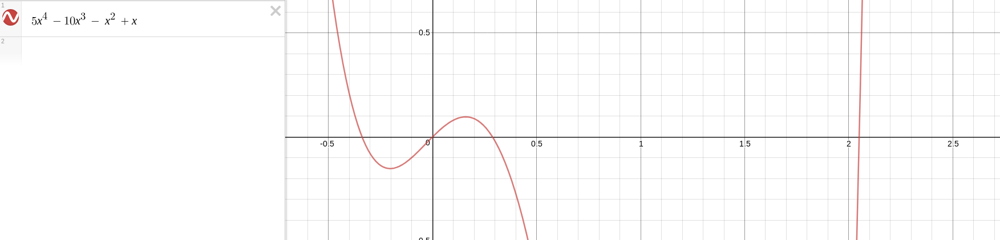
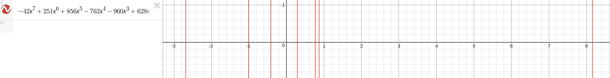

# computor_v1

This project is about creating a small command-line tool which helps you solve polynomial equations.

## Usage examples

### invalid input
```
>  python computor.py "42 X^2 + 1"
No or too many '=' found


> python computor.py "42 X^2 + 1 = "
Part of equation can not be left blank


> python computor.py "42 X^2 = 0 + "
42 X^2 = 0 + 
           ^
Unrecognised symbol '+' at index 11


> python computor.py "42 X^2 + a * X = 0" 
42 X^2 + a * X = 0
       ^
Unrecognised symbol '+' at index 7


> python computor.py "42 X^2 + 7 * 8 * X = 0"
42 X^2 + 7 * 8 * X = 0
           ^
Unrecognised symbol '*' at index 11

```

### polynomial equations with degree 0

```
> python computor.py "42 + 1 = 0"
Polynomial degree: 0
Reduced form:  + 0 * X^2 + 0 * X + 43 = 0
This equation has no solutions


> python computor.py "42 + 1 = 43"
Polynomial degree: 0
Reduced form:  + 0 * X^2 + 0 * X + 0 = 0
All real numbers are solutions for this equation

```

### polynomial equations with degree 1 (linear equations)
```
> python computor.py "42X = 21"
Polynomial degree: 1
Reduced form:  + 0 * X^2 + 42 * X - 21 = 0
Solution: 
0.5

```

### polynomial equations with degree 2 (quadratic equations)
```
> python computor.py "X^2 + 2X - 3 = 0"
Polynomial degree: 2
Reduced form:  + 1 * X^2 + 2 * X - 3 = 0
D =  16
Discriminant strictly positive, getting answer as two real numbers:
-3.0
1.0


> python computor.py "X^2 - 6X + 34 = 0"
Polynomial degree: 2
Reduced form:  + 1 * X^2 - 6 * X + 34 = 0
D =  -100
Discriminant strictly negative, getting answer as two complex numbers:
3 - 5 * i
3 + 5 * i

```


### polynomial equations with degree bigger then 3
This feature is quite experimental.
It`s usage suggests that all n roots fo the equation are real numbers.

Lobachevsky method is being used as a method for finding approximate roots.

#### 5X^4 - 10X^3 - X^2 + X = 0

```
> python computor.py "5X^4 - 10X^3 - X^2 + X = 0"

Polynomial degree: 4
Reduced form:  + 5 * X^4 - 10 * X^3 - 1 * X^2 + 1 * X + 0 = 0
It looks like equation inputted has degree greater then 2.
Hopefully you know what you are doing 🤔
Presuming all roots are real numbers, trying to solve the equation using lobachevsky method... 
[0, 1, -1, -10, 5]   =>
 [0, 1, 21, 110, 25] 


Caution: this answers are approximate:
[-0.3760603093086394, -0.0, 0.25935936343157395, 2.050550952384682]

```


#### - 42X^7 + 251X^6 + 856X^5 - 762X^4 - 960X^3 + 628X^2 + 172X - 76 = 0

```
> python computor.py "-42 X^7 + 251 X^6 + 856 X^5 -762 X^4 -960 X^3 + 628 X^2 + 172 X - 76 = 0"
Polynomial degree: 7
Reduced form:  - 42 * X^7 + 251 * X^6 + 856 * X^5 - 762 * X^4 - 960 * X^3 + 628 * X^2 + 172 * X - 76 = 0
It looks like equation inputted has degree greater then 2.
Hopefully you know what you are doing 🤔
Presuming all roots are real numbers, trying to solve the equation using lobachevsky method... 
[-76, 172, 628, -960, -762, 856, 251, -42]   =>
 [5776, 125040, 840448, 2211288, 2553868, 1195900, 134905, 1764] 


[5776, 125040, 840448, 2211288, 2553868, 1195900, 134905, 1764]   =>
 [33362176, 5926146304, 182856220800, 894520362656, 1459603256784, 748919108984, 13980223825, 3111696] 


[33362176, 5926146304, 182856220800, 894520362656, 1459603256784, 748919108984, 13980223825, 3111696]   =>
 [1113034787454976, 22918247174363938816, 22931671484731166597120, 275247083998458827063808, 795707586186131048596480, 520074238301178720603808, 190785841005599476897, 9682651996416] 


Caution: this answers are approximate:
[-2.6879236286908337, -1.0157388721168215, -0.4196160727268931, 0.29078103498072605, 0.7625214968164836, 0.8727373315011737, 8.162279567633538]

```